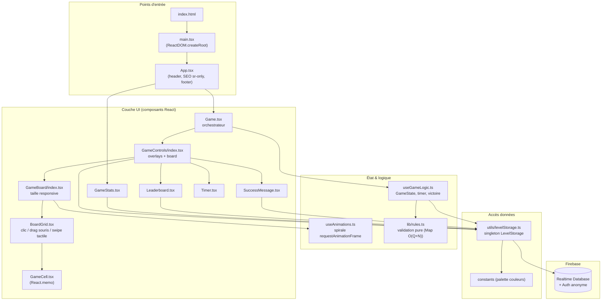
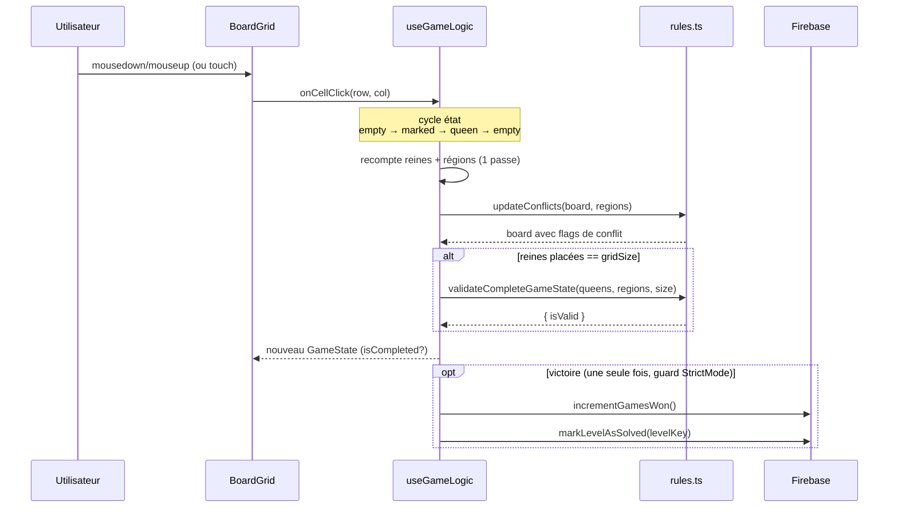
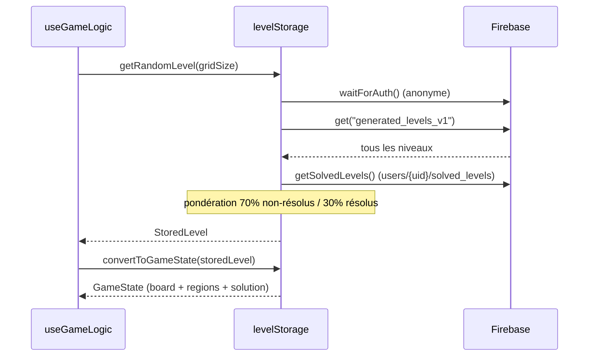

# Architecture — Queens Game Web

> Document synchronisé avec le code source réel (voir `src/`).
> Dernière vérification : audit du 2026-08-17.

Queens Game Web est une SPA React sans backend applicatif : toute la logique de jeu
s'exécute côté client, et **Firebase Realtime Database** sert uniquement de couche de
persistance (niveaux, scores, statistiques, présence). Il n'y a **aucune génération de
niveau côté client** — les grilles sont lues depuis Firebase.

## Vue d'ensemble des couches

## Cycle de vie d'un clic sur une cellule

Un clic déclenche **un seul `setGameState`** ; validation des conflits et détection de
victoire sont synchrones dans le même callback (pas de `setTimeout` différé).

## Chargement d'un niveau

## Modèle de données Firebase

| Chemin                                   | Contenu                                        |
|------------------------------------------|------------------------------------------------|
| `generated_levels_v1/{key}`              | `{ gridSize, complexity, regions, createdAt }` |
| `leaderboards/grid_{size}/{key}`         | `{ userId, playerName, time, timestamp, gridSize }` |
| `stats/total_games_won`                  | compteur global de victoires                   |
| `stats/total_games`                      | compteur de parties (⚠️ non alimenté, voir audit) |
| `users/{uid}/solved_levels/{levelKey}`   | `{ timestamp }`                                |
| `presence/users/{uid}`                   | `{ timestamp }` (+ `onDisconnect().remove()`)  |

## Contrôles réels (source : `BoardGrid.tsx`)

- **Clic simple** : cycle `vide → marqué (❌) → reine (👑) → vide`. **Il n'y a pas de double-clic.**
- **Glisser-souris (desktop)** : marque en série les cellules vides traversées (`onMarkCell`).
- **Swipe tactile (mobile)** : idem au drag souris ; `touchAction: none` bloque le scroll.
- Un `tap` sans mouvement retombe sur le cycle de clic simple.

## Décisions d'architecture notables

- **Pas de state manager externe** : `useState` + `useCallback` dans des hooks custom.
- **`levelStorage` = singleton** instancié au chargement du module avec la config Firebase.
- **Mémoïsation** : `React.memo` (comparateur custom sur `GameCell`), `useMemo` pour
  styles de bordure et ordre spirale.
- **Délégation d'événements** : handlers souris/tactile posés sur le conteneur de grille,
  résolution de cellule via `data-row`/`data-col` + `document.elementFromPoint`.
- **Caches côté client** : leaderboard 30 s, stats 60 s (voir réserve dans l'audit).
